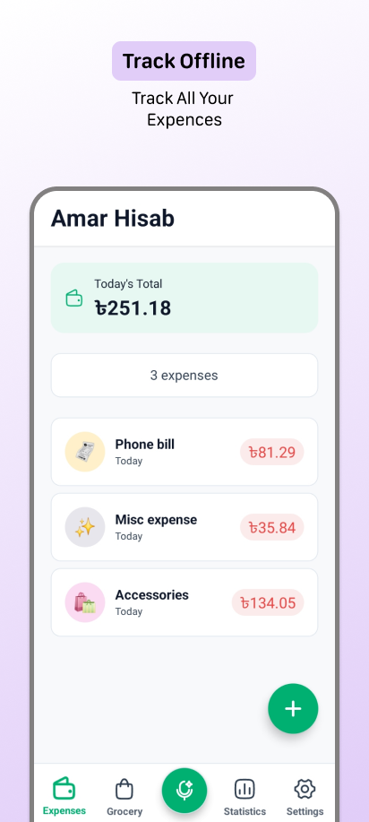
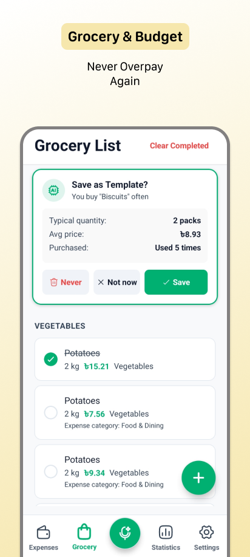
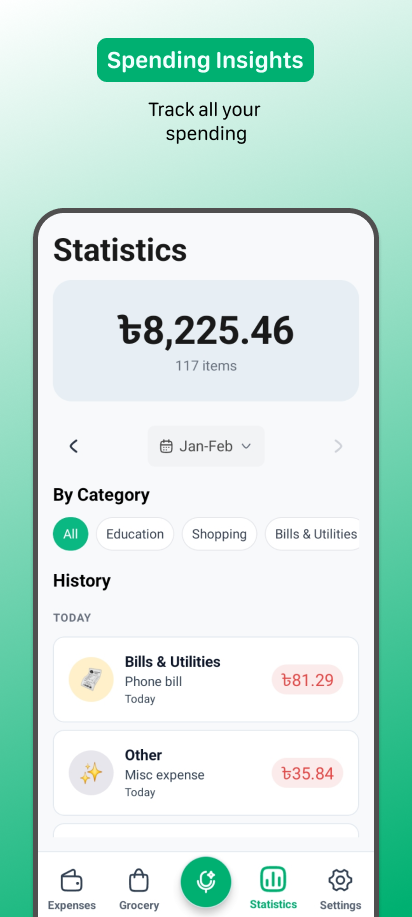
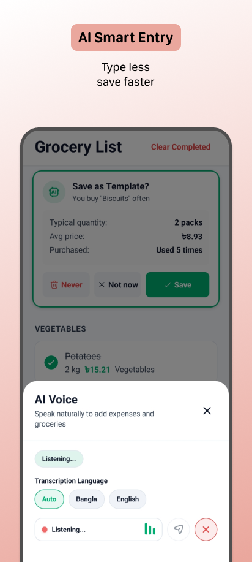

# 💰 Amar Hisab (আমার হিসাব)

<div align="center">

**Your Personal Expense Tracker**

_A beautiful, minimalistic expense tracker with integrated grocery list management_

**Platform: Android only**

[](LICENSE)

[📥 Download APK from Releases](https://github.com/Frazix12/AmarHisab/releases) • [🐛 Report Bug](https://github.com/Frazix12/AmarHisab/issues)

</div>

---

## 📸 Screenshots

<p align="center">
  
  
  
  
</p>

## 📱 About the App

Amar Hisab is a privacy-first, offline expense tracker. It combines daily expense tracking with a smart grocery list, allowing users to effortlessly monitor their spending. By leveraging on-device storage, the app ensures your financial data never leaves your phone.

### ✨ Key Features

- **Daily Expenses**: Track, categorize, and attach photos to your spending easily.
- **Grocery List**: Manage shopping lists and instantly convert purchased items into expenses.
- **AI Integration**: Features AI Voice Mode and smart templates for frictionless data entry (using your own Gemini API key).
- **Multi-lingual**: Instantly toggle between English and Bangla UI.
- **Currency Support**: Track spending in major currencies like USD, EUR, GBP, BDT, and INR.

## 🛠️ Tech Stack & Architecture

Amar Hisab is built using modern cross-platform mobile development technologies, prioritizing performance and rich user experiences.

- **Framework**: [Expo](https://expo.dev) SDK 54 / [React Native](https://reactnative.dev)
- **Language**: TypeScript
- **State & Navigation**: React Context API and Expo Router
- **Database**: Drizzle ORM + Expo SQLite (Offline-first approach)
- **UI & Animations**: Custom Material Design 3 implementation with 60fps animations powered by React Native Reanimated.

## 🚀 Development & Setup

### Prerequisites

- Node.js 18+ or Bun
- Expo CLI
- Android Emulator or physical device

### Getting Started

```bash
# Clone the repository
git clone https://github.com/Frazix12/AmarHisab.git
cd AmarHisab/app

# Install dependencies
npm install

# Start the Expo development server
npm start
```

Press `a` in the terminal to launch the app on an Android emulator, or scan the QR code with the Expo Go app on your physical device.

### Building for Production

To build the APK locally using EAS:

```bash
eas build -p android --profile preview
```

## 🤝 Contributing

Contributions are always welcome. Feel free to open a Pull Request or create an Issue if you have feature requests or bug reports.

## 📝 License

This project is licensed under the MIT License - see the [LICENSE](LICENSE) file for details.
